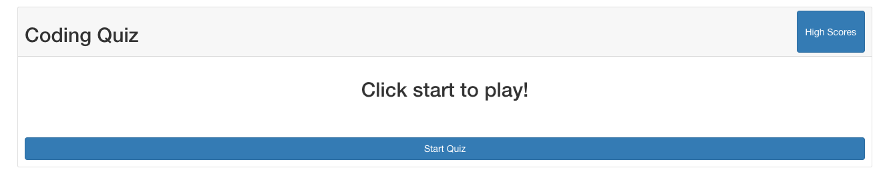
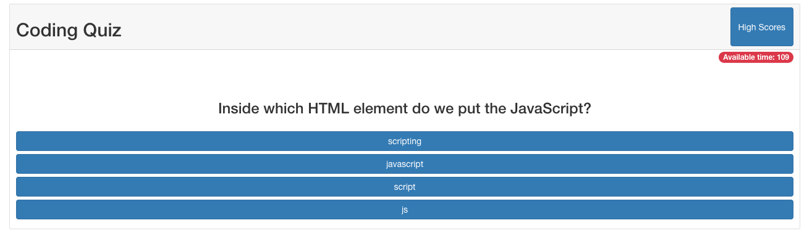
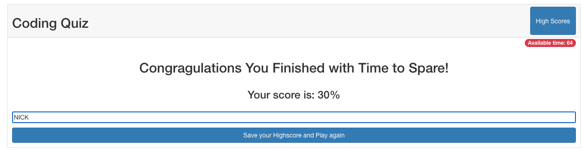
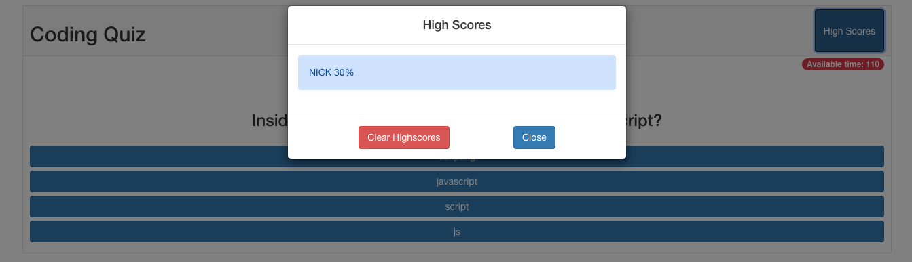

# Coding-Quiz

## User Story

```
AS A coding boot camp student
I WANT to take a timed quiz on JavaScript fundamentals that stores high scores
SO THAT I can gauge my progress compared to my peers
```

## Acceptance Criteria

```
GIVEN I am taking a code quiz
WHEN I click the start button
THEN a timer starts and I am presented with a question
WHEN I answer a question
THEN I am presented with another question
WHEN I answer a question incorrectly
THEN time is subtracted from the clock
WHEN all questions are answered or the timer reaches 0
THEN the game is over
WHEN the game is over
THEN I can save my initials and my score
```
## Implementation

In order to acheive an organized quiz application I modularized my code by making each 
criteria a function which contains a function call to the next. In addition to this 
I also did not want to load another page for each question as that would be too 
extensive so I created and removed elements in the DOM where I needed to. For the overall
styling I decided to use the Bootstrap library.

### Below you will find screen shots of the quiz



####Hard coded in the index.html
```html
<div class="card-header d-flex w-100 justify-content-between" id="quiz-title">
    <h2>Coding Quiz</h2>

    <button type="button" class="btn btn-primary"> High Scores </button>
</div>

<div class="d-flex mt-1 me-3 justify-content-end">
    <!-- Area to be populated with time left -->
    <span class="badge bg-danger" id="time"></span>
</div>

<div class="card-body d-flex flex-column ">
    <!-- Area to be populated by the question of the quiz -->
    <h2 class="align-self-center" id="quiz-heading">Click start to play!</h2>
    <h3 class="card-title align-self-center" id="quiz-question"></h3>
</div>

<div class="card-body d-flex flex-column justify-content-center" id="quiz-buttons">
    <!-- Area to be populated by the multiple choice selections -->
    <button type="button" class="btn btn-primary" id="start-quiz">Start Quiz</button>
</div>
```
***

#### Dynamically created in script.js by traversing the DOM
```javascript
// Create a button for every question choice
for(let i = 0; i < quizBank[quizCount].choices.length; i ++)
{
    const btn = document.createElement("button");
    btn.classList.add("question", "btn" , "btn-primary" , "mb-2" , "pt-2" , "pb-2");
    btn.innerHTML = quizBank[quizCount].choices[i];
    quizOptions.appendChild(btn)
}
```
***

#### Created in script.js by selecting DOM elements

***

#### Crested using Bootstrap modal and accessing local storage in script.js
```javascript
function generateHighscores()
{
    // remove elements from list to prevent duplicates
    document.querySelectorAll('.alert').forEach(item => item.remove());

    let scoreList = JSON.parse(localStorage.getItem("user"));

    // iterate through each object in storage and append the data to highscores area
    for(let i = 0; i < scoreList.length; i ++)
    {
        const scoreElement = document.createElement("div");
        scoreElement.classList.add("alert", "alert-primary");
        scoreElement.setAttribute("role" , "alert");
        scoreElement.textContent = scoreList[i].name + "  " + Math.round((scoreList[i].highScore/quizBank.length)*100) + "%";
        scoreEl.appendChild(scoreElement);
    }
}
```

## You can view the deployed application via [Coding-Quiz](https://nkrilis.github.io/Coding-Quiz/) 
## Thank you for reading me :smiley:
